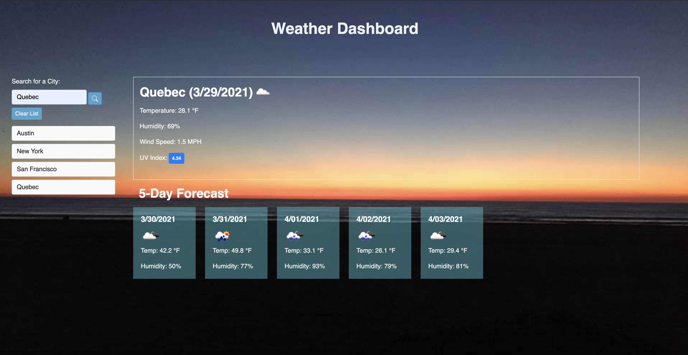

## Weather App

- [Description ](#description)
- [Installation and Usage](#installation-and-use)
- [License](#license)

# Description

This is a simple weather app that makes use of the Open Weather API return the current weather (temperature, humidity, wind speed, and UV Index), as well as the 5-day forecast (displaying the temperature and humidity), when a user search a city. In addition to these data points, an icon reflecting the general forecast for that day is shown, and the UV Index is displayed inside a badge that displays a color reflective of the level of severity.

When cities are searched, they are entered into a column below the search field that shows recent searches, and allows the user to click back to them. These recent searches are saved to localStorage, and will load on future visits to the page.

This page has been deployed on Github, and can be viewed here: https://tomekregulski.github.io/weather-app/

# Installation and Use

Clone the repo and open the folder in the code editor of your choice.

# License

[MIT License](https://opensource.org/licenses/MIT)
